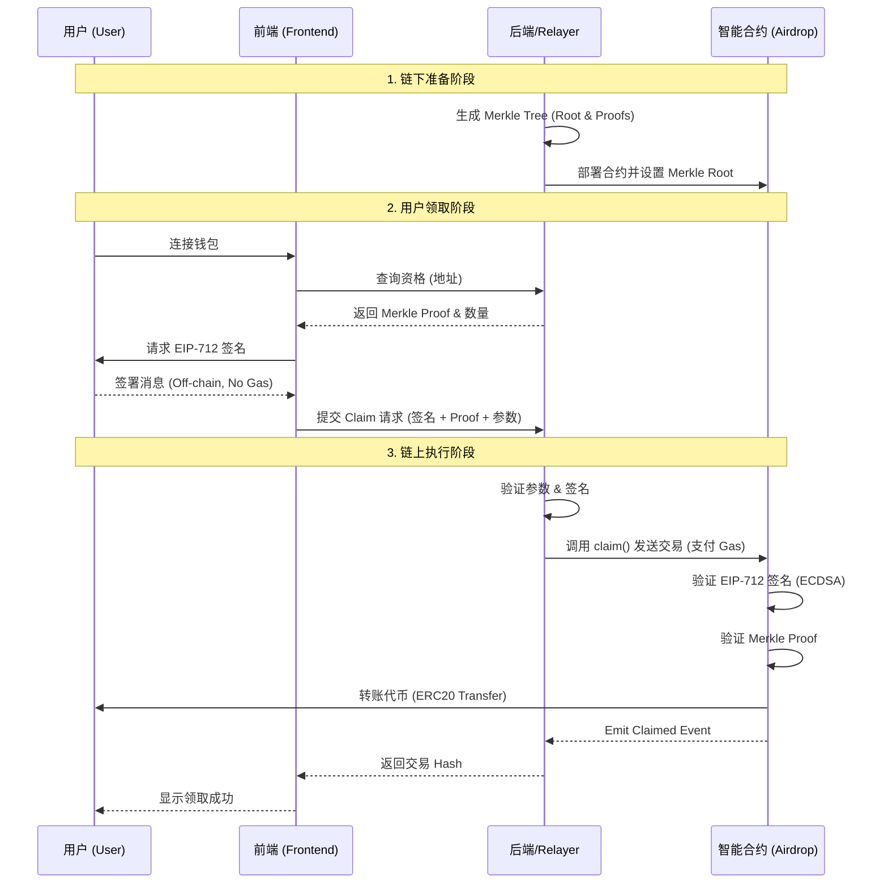
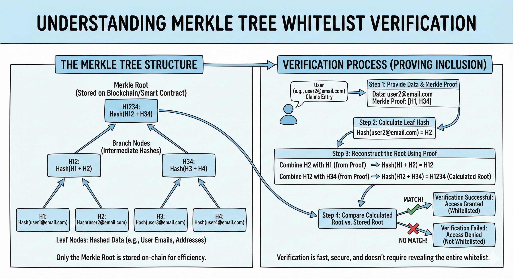
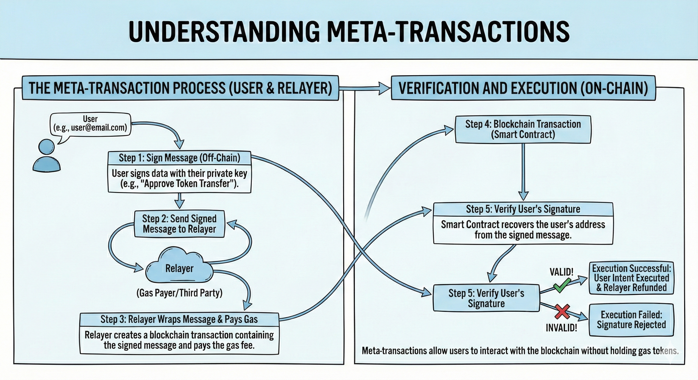
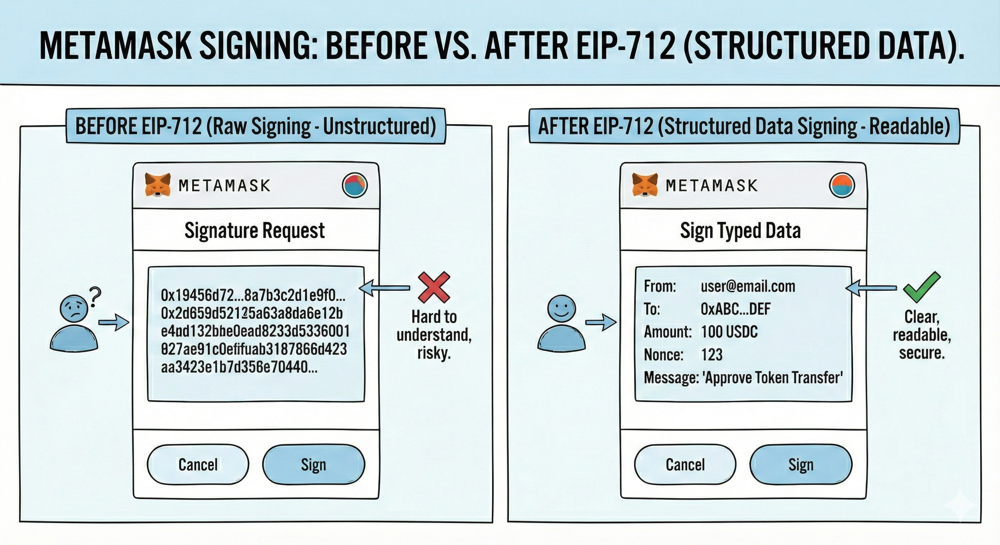
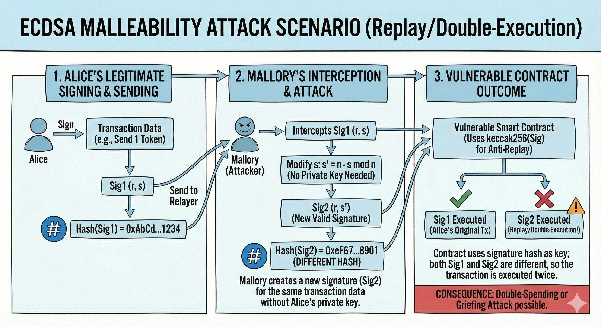

# 构建无 Gas 费的空投系统：Merkle Tree 与 EIP-712 实战指南

## 1. 引言 (Introduction)

在 Web3 开发的学习旅程中，空投（Airdrop）是一个非常经典且实用的场景。本项目基于 [Cyfrin Updraft](https://updraft.cyfrin.io/courses/advanced-foundry/merkle-airdrop/introduction) 的高级 Foundry 课程进行扩展，旨在实现一个功能完整的 **Gasless Merkle Airdrop (无 Gas 默克尔树空投)** 系统。

- **Github 仓库**: [Cyfrin/foundry-merkle-airdrop-cu](https://github.com/Cyfrin/foundry-merkle-airdrop-cu) (原始课程仓库) / [Your-Repo-Link](https://github.com/your-username/merkle-airdrop) (本项目仓库)

通过这个项目，我们不仅能学习智能合约开发，还能深入理解全栈 Web3 应用的架构。你将掌握：

- **链上白名单的实现原理**：如何在去中心化环境中高效管理用户资格。
- **默克尔树 (Merkle Tree)**：如何利用哈希树结构极大地节省链上存储成本。
- **EIP-712 签名**：如何让用户签名变得既安全又可读。
- **无 Gas 交易 (Meta-Transactions)**：如何通过 Relayer 模式降低用户门槛。

## 核心交互流程

为了更直观地理解整个系统的运作方式，我们梳理了从“用户点击领取”到“代币到账”的完整时序图。



## 2. 核心原理拆解 (Core Concepts)

### 链上白名单 (On-chain Whitelist)

在空投活动中，我们需要一种机制来确定“谁有资格领取”以及“能领多少”。也就是说我们需要一个白名单系统来管理用户资格。

#### Web2 实现方案

我们先回到 Web2 实现方案,实现方案比较简单：

1. 将白名单数据存储在中心化数据库（如 MySQL/PostgreSQL）中。
   如果用户基数比较大，我们可以实现多级缓存，例如： - 一级缓存：内存缓存（如 Redis），用于存储高频查询的白名单数据。 - 二级缓存：数据库缓存（如 MySQL 或 PostgreSQL），用于存储冷数据。
2. 用户领取空投时，我们还可以前置使用布隆过滤器（Bloom Filter）来快速判断一个地址是否在白名单中，从而过滤大部分无效请求。

> 这里简单介绍 Web2 实现白名单的一些优化方案，例如多级缓存、布隆过滤器等。

#### Web3 实现方案

回到 Web 3 世界，链上合约我们不能使用中心化数据库，很容易想到的一个解决方案是将白名单数据存储在合约中，使用数组或者映射（Map）来存储白名单数据。

#### 链上 Map 实现

简单实现代码：

```solidity

// 存储方案
mapping(address => uint256) public whitelist; // 地址 => 数量

//  白名单批量写入
function batchAddWhitelist(address[] calldata _addresses, uint256[] calldata _quantities) external onlyOwner {
    for (uint256 i = 0; i < _addresses.length; i++) {
        whitelist[_addresses[i]] = _quantities[i];
    }
}

```

这个实现方案存在几个问题：

_写入成本极高 (SSTORE)_

每向 mapping 写入一个新的 address（将 storage slot 从 0 变为 non-zero），消耗的 Gas 大约是 20,000 gas（不含基础交易费）。如果存在 1000 个白名单用户将会消耗 20,000,000 Gas，约等于 2000 美元 ETH，这是一个非常高的成本。

如果白名单用户数量比较大，由于单个区块存在 Gas 限制，我们不能一次性写入所有用户。我们需要分批次发送发送几十笔交易，这里操作成本也会比较高。

_操作繁琐 (Admin Overhead)_

每次更新白名单（新增或移除），都需要管理员由私钥签名并广播交易。这不仅慢，而且让后端运维变得复杂且中心化。

### 2.1 默克尔树 (Merkle Tree)：链上存储的“压缩技术”

链上存储昂贵，所以我们可以换一种思路，使用时间换空间的方案，将存储计算转移到链下，链上只负责验证。这里就需要使用到默克尔树 (Merkle Tree)。



默克尔树是一种哈希二叉树。

1.  我们将所有白名单数据 `(地址, 数量)` 进行哈希，作为树的**叶子节点**。
2.  叶子节点两两配对再次哈希，向上层层递进。
3.  最终生成一个唯一的 32 字节哈希值，称为 **Merkle Root (默克尔根)**。

链上合约只要存储一个 **一个** 32 字节的 `Merkle Root`，成本是非常低的，其他所有数据都存储在链下。

用户领取空投时，用户领取时，只需提供一条从叶子节点到根节点的“路径”哈希值（称为 **Merkle Proof**）。合约通过简单的哈希计算，就能验证该用户是否属于这棵树。

这就像是指纹验证。你不需要随身携带你的整个档案袋，只需要按一下指纹（Hash），系统比对指纹特征（Proof & Root），就能确认你的身份。

#### Merkle Root 验证实现 (Code Snippet)

在合约中，我们使用 OpenZeppelin 的 `MerkleProof` 库来验证用户提供的 Proof 是否有效。

```solidity
import "@openzeppelin/contracts/utils/cryptography/MerkleProof.sol";

function verifyEntitlement(
    address _claimer,
    uint256 _amount,
    bytes32[] calldata _merkleProof
) public view returns (bool) {
    // 1. 生成叶子节点哈希 (Leaf Hash)
    // 注意：编码方式必须与链下生成树时保持一致（通常是 abi.encodePacked）
    bytes32 leaf = keccak256(abi.encodePacked(_claimer, _amount));

    // 2. 验证 Proof
    // MerkleProof.verify 计算叶子 + Proof 是否能还原出 Merkle Root
    return MerkleProof.verify(_merkleProof, merkleRoot, leaf);
}
```

### 2.2 元交易 (Meta-Transactions)：让别人替你付 Gas

通常，用户直接与合约交互，需要发起一笔交易并支付 ETH 作为 Gas 费，这对于新用户或钱包没余额的用户是巨大的门槛。
项目方为了用户体验，可以为用户代付 Gas 费。这里就需要 Meta-Transactions（元交易）解决方案， 简单来说，它允许用户**“签名交易意图”，而让第三方（Relayer）“代付 Gas 并上链”**。



**流程**：

1.  **用户**：在链下使用自己的私钥对“领取操作”这个消息进行**签名**。这一步没有向链上发送交易，所以是免费的。
2.  **Relayer (中继器)**：通常由项目方运营的后端服务。它收集用户的签名，包装成一笔交易，发送给智能合约。
3.  **合约**：验证签名确实来自该用户，然后执行代币分发。
4.  **Gas 费**：由 Relayer 支付，用户实现“零成本”领取。

### 2.3 EIP-712：拒绝“盲签”

用户需要使用自己钱包对消息签名，需要对待签名的消息进行确认。

早期的以太坊签名（`eth_sign`）存在两个问题：

- **前缀（标准规范）不统一**：不同钱包对消息的前缀处理不同，导致签名不一致。
- **显示为 16 进制乱码**：用户在钱包中看到的签名是一串难以理解的 16 进制字符，根本不知道自己签了什么，这被称为“盲签”。这就好比让你在一张白纸上签字，而你根本看不到白纸背面写了什么条款，这极不安全，很容易被钓鱼攻击。

**EIP-712 (Ethereum Improvement Proposal 712)** 定义了**结构化数据**的哈希和签名标准。它的核心目的是让签名内容对用户“**可读**”。

#### EIP-712 原理通俗解释

EIP-712 就像是一份格式规范的“合同模板”。

1.  **Domain Separator (域分隔符)**：

    - 这就好比合同的**抬头**。它规定了这份合同属于哪个**项目**（Name）、哪个**版本**（Version）、在哪条**链**上（ChainId）、以及由哪个**合约**（VerifyingContract）执行。
    - **作用**：防止“张冠李戴”。如果你在 A 项目签的字，黑客不能把它拿到 B 项目去用；你在测试网签的字，也不能拿到主网上去用。

2.  **Typed Data Hashing (类型化数据哈希)**：
    - 这就好比合同的**正文条款**。EIP-712 规定了数据的类型（如 `address`, `uint256`）和名称。
    - **作用**：确保数据格式统一。钱包可以解析这些数据，并以清晰的格式展示给用户。

**MetaMask 的变化**：
当使用 EIP-712 时，MetaMask 不再显示一串乱码，而是弹出一个清晰的卡片，列出你正在签署的具体内容：

```text
User: 0x123...
Amount: 100 Tokens
Nonce: 1
```



#### EIP-712 合约实现 (Code Snippet)

在合约中实现 EIP-712 验证非常简单，借助 OpenZeppelin 的 `EIP712` 和 `ECDSA` 库即可：

```solidity
// 定义数据结构的 Type Hash
bytes32 private constant CLAIM_TYPEHASH = keccak256("Claim(address claimer,uint256 amount)");

function getMessageHash(address _claimer, uint256 _amount) public view returns (bytes32) {
    // 1. 对数据进行哈希
    bytes32 structHash = keccak256(abi.encode(CLAIM_TYPEHASH, _claimer, _amount));

    // 2. 结合 Domain Separator 生成最终的签名摘要
    // OpenZeppelin 的 _hashTypedDataV4 会自动处理 Domain Separator
    return _hashTypedDataV4(structHash);
}

function verify(bytes32 digest, bytes memory signature) public view returns (bool) {
    // 3. 恢复签名者地址
    return ECDSA.recover(digest, signature) == msg.sender;
}
```

## 3. 安全与挑战 (Security & Challenges)

合约代码实现过程中，涉及到一些进阶安全细节，需要注意。

### 3.1 ECDSA 签名可塑性 (Signature Malleability)

在以太坊中，ECDSA 签名由三个值组成：`(v, r, s)`。这些值通常打包成 65 字节的序列。

#### 什么是“可塑性”？

**核心问题**：对于同一个消息哈希和同一个私钥，存在 **两个** 有效的签名。

这是由椭圆曲线密码学（secp256k1）的数学性质决定的。

- `s` 是签名的核心部分之一。
- 如果 `(v, r, s)` 是一个有效签名，那么 `(v', r, n - s)` 也是一个有效签名（其中 `n` 是椭圆曲线的阶）。

**攻击场景**：



1.  Alice 签名了一笔交易，发送给 Relayer。签名是 `Sig1`。
2.  Mallory（攻击者）截获了 `Sig1`。
3.  Mallory 不需要 Alice 的私钥，仅仅通过数学计算 `n - s`，就可以生成一个新的签名 `Sig2`。
4.  Mallory 将 `Sig2` 提交上链。
5.  **后果**：
    - 虽然 `Sig2` 依然会解包出 Alice 的地址（因为数学上是有效的），但 `Sig2` 的 **哈希值 (Keccak256)** 与 `Sig1` 不同。
    - 如果你的合约逻辑是：`mapping(bytes32 => bool) executedSignatures`，使用 `keccak256(signature)` 作为防重放的 Key。
    - 那么 Mallory 就可以成功提交 `Sig2`，导致 Alice 的这笔交易被执行 **两次**（如果业务逻辑允许的话），或者导致 Alice 原始的 `Sig1` 交易失败（抢跑攻击）。

#### 代码对比：漏洞 vs 防御

解决签名可塑性的问题，有两个解决思路：

1.  **强制使用椭圆曲线下半区的签名**：
    - 当使用 OpenZeppelin 的 `ECDSA` 库时，它会自动检查 `s` 是否在 "下半部分"（即 `s <= n / 2`）。
    - 如果 `s > n / 2`，`ECDSA.tryRecover` 会返回错误，从而防止使用 `(v, r, n - s)` 形式的签名。

**❌ 危险的写法 (使用原生 `ecrecover`)**：

```solidity
function recover(bytes32 hash, uint8 v, bytes32 r, bytes32 s) internal pure returns (address) {
    // ecrecover 不会检查 s 是否在 "下半部分"
    // 它会接受 (n - s) 形式的签名
    return ecrecover(hash, v, r, s);
}
```

**✅ 安全的写法 (使用 OpenZeppelin `ECDSA`)**：

```solidity
import "@openzeppelin/contracts/utils/cryptography/ECDSA.sol";

function claim(...) {
    // ECDSA.tryRecover 会强制检查 s <= n / 2
    // 如果 s > n / 2，它会直接返回错误，从而消除了可塑性
    (address recovered, ECDSA.RecoverError err, ) = ECDSA.tryRecover(digest, signature);

    if (err != ECDSA.RecoverError.NoError) {
        revert("Invalid signature");
    }
    require(recovered == claimer, "Invalid claimer");
}
```

2.  **不要依赖签名哈希进行防重放检查**：
    - 由于可塑性，`Sig1` 和 `Sig2` 虽然数学意义相同，但它们的字节串（和哈希值）不同。
    - 如果合约逻辑是 `if (usedSignatures[keccak256(signature)]) revert();`，攻击者提交 `Sig2` 就能绕过检查。
    - **正确做法**：利用业务状态（如 `hasClaimed[user]`）或消息内容的唯一标识（Nonce）来防止重放。

### 3.2 并发与 Nonce 管理

当空投活动开始，大量用户同时发起无 Gas 领取请求，由于所有交易均由单一 Relayer 账户发出，受限于以太坊的 Nonce 串行机制，该账户将成为典型的写热点 (Write Hotspot)，导致严重的并发冲突。

#### 什么是 Nonce 冲突？

在以太坊中，为了防止重放攻击，每个外部账号（EOA）发出的每一笔交易都必须携带一个严格递增的整数，称为 **Nonce**。

- 第一笔交易 Nonce = 0
- 第二笔交易 Nonce = 1
- ...以此类推。

**并发场景下的灾难**：
假设当前 Relayer 钱包的链上 Nonce 是 `10`。

1.  **请求 A** 到达后端，查询链上 Nonce，得到 `10`。
2.  **请求 B** 几乎同时到达，也查询链上 Nonce，同样得到 `10`。
3.  后端为 A 构建交易（Nonce=10）并广播。
4.  后端为 B 构建交易（Nonce=10）并广播。
5.  **结果**：矿工/验证者只会打包其中一笔（比如 A），另一笔 B 会因为 "Nonce too low" 或 "Replacement transaction underpriced" 而被丢弃。B 用户虽然签了名，却领不到币。

#### 解决方案 1：单钱包串行管理 (Single Wallet Management)

这是最基础的思路：既然一个钱包的 Nonce 必须串行，那我们就想办法保证串行。

- **基础版：内存互斥锁 (Mutex)**

  - **逻辑**：代码层面加锁，强制所有请求排队。一个请求发完交易，Nonce 自增后，下一个请求才能进。
  - **评价**：实现简单（本项目采用），但性能差，TPS 完全受限于单线程和网络延迟。

- **进阶版：队列 + Worker (Queue System)**
  - **逻辑**：使用消息队列（如 Redis/RabbitMQ）缓冲请求。后端启动一个单线程 Worker，从队列取任务，维护本地 Nonce 计数器，连续广播交易。
  - **评价**：实现了削峰填谷，用户体验好。但本质上依然是单点写入，上限受限于以太坊节点的接收速率。

#### 解决方案 2：多钱包分片扩展 (Multi-Wallet Sharding)

如果一个钱包发不过来，那就用 10 个！这是横向扩展（Scale Out）的思路。

- **逻辑**：
  1.  准备 N 个 Relayer 钱包地址（都有 ETH）。
  2.  当用户请求到达时，根据用户 ID 或地址进行哈希取模：`walletIndex = hash(userAddress) % N`。
  3.  将该用户的请求分配给对应的第 `walletIndex` 个钱包处理。
- **评价**：并发能力直接提升 N 倍。结合“队列 + Worker”模式（每个钱包对应一个 Queue 和一个 Worker），可以构建出高性能的交易中继网络。

## 5. 总结

通过构建这个 Gasless Merkle Airdrop 系统，不仅仅是完成了一个代码练习，更是对现代 Web3 应用架构的一次全景式扫描。从底层的 Merkle Tree 算法，到中间层的 EIP-712 签名协议，再到上层的 Relayer 并发处理，每一个环节都蕴含着去中心化应用设计的核心智慧。

在这个过程中，我有以下几点深刻的感悟：

- **代码即金钱 (Code is Money) —— Gas 优化意识的觉醒**
  在 Web2 开发中，低效的代码可能仅仅意味着多占用了几 MB 内存或 CPU，通常可以被忽略或通过堆硬件解决。但在 Web3 中，每一行 Solidity 代码的执行都需要消耗真金白银（Gas）。

  - 直接在链上存储数组会导致天价 Gas，而 Merkle Tree 将其压缩为 32 字节，这就是 Web3 极致的成本控制艺术。
  - 作为开发者，必须时刻保持“Gas 敏感度”，在数据结构选择和逻辑实现上锱铢必较。

- **链上链下分离 (Off-chain Compute, On-chain Verify)**
  这是 Web3 扩容和架构设计的核心范式。
  - **链下 (Off-chain)**：负责繁重的计算（如生成 Merkle Tree）、复杂的数据存储和用户交互（如签名）。这里是性能的“舒适区”。
  - **链上 (On-chain)**：只负责最关键的、轻量级的“验证”（Verify）。这里是信任的“锚点”。
    这种**“链下计算 + 链上验证”**的模式，既保留了去中心化的信任（Trustless），又规避了区块链的性能瓶颈。这也是目前 ZK-Rollup、预言机（Oracle）等基础设施背后的底层逻辑。

## 6. 参考资料 (References)

- [Foundry Merkle Airdrop Course (Cyfrin)](https://updraft.cyfrin.io/courses/advanced-foundry/merkle-airdrop/introduction)
- [OpenZeppelin ECDSA Documentation](https://docs.openzeppelin.com/contracts/4.x/api/utils#ECDSA)
- [EIP-712 Standard](https://eips.ethereum.org/EIPS/eip-712)
- [Merkle Tree Visualization](https://lab.miguelmota.com/merkle-proof/example/)
